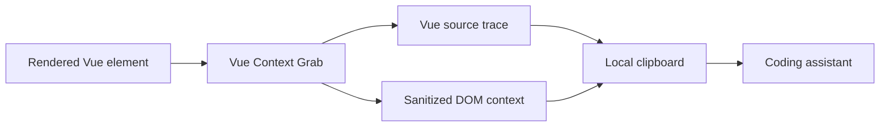

<h1 align="center">Vue Context Grab</h1>

<p align="center"><strong>Point at the Vue UI. Paste the context your coding agent needs.</strong></p>

<p align="center">
  A development-only element picker for Vue 3 and Vite. Select rendered UI and copy its source location, component ancestry, sanitized HTML, bounds, and computed styles in one prompt-ready block.
</p>

<p align="center">
  <a href="LICENSE"></a>
  <a href="package.json"></a>
  <a href="package.json"></a>
  <a href="https://bun.sh"></a>
</p>

<p align="center">
  <a href="#quickstart"><strong>Quickstart</strong></a> ·
  <a href="#how-it-feels"><strong>How it feels</strong></a> ·
  <a href="#keyboard"><strong>Keyboard</strong></a> ·
  <a href="#privacy-boundary"><strong>Privacy</strong></a> ·
  <a href="#options"><strong>Options</strong></a>
</p>

---

UI feedback often starts like this: "the small button near the top right looks flat." That is enough for a person who can see the screen. It leaves a coding agent hunting through templates, components, and CSS.

Vue Context Grab turns the rendered element into concrete context:

```text
<button>
resources/js/components/student/StudentCommandPalette.vue:210:12
```

The copied payload also includes the route, viewport, preferred color scheme, source ancestry, element bounds, sanitized markup, and a focused set of computed styles. You paste it into Codex, Claude Code, or another coding assistant and describe the change.

## Quickstart

Install directly from GitHub:

```sh
bun add -d github:enzodevs/vue-context-grab
```

Add the plugin after Vue in `vite.config.ts`:

```ts
import vue from "@vitejs/plugin-vue";
import { defineConfig } from "vite";
import { vueContextGrab } from "vue-context-grab/vite";

export default defineConfig({
  plugins: [
    vue(),
    vueContextGrab({
      appendTo: "src/main.ts",
      buttonPosition: "bottom-center",
    }),
  ],
});
```

`appendTo` must match your browser entry module. The plugin runs only during `vite serve`. Production builds receive neither the picker runtime nor Vue source instrumentation.

Start the app, then press `Ctrl+C` anywhere that is not an input or a text selection.

## How it feels

1. Activate the picker with its button or `Ctrl+C`.
2. Hover an element. The overlay shows an XML-style tag and its Vue source.
3. Use the arrow keys when the first target is too broad or too narrow.
4. Press Enter or click to copy.
5. Paste the result into your coding assistant with the change you want.

The badge confirms a successful copy with a short check animation. You can minimize it to a compact edge control when it gets in the way. Activating the keyboard shortcut restores the full badge automatically.



## Keyboard

| Key       | Result                                                 |
| --------- | ------------------------------------------------------ |
| `Ctrl+C`  | Start or stop selection when native copy is not active |
| `↑`       | Move to a source-aware parent                          |
| `↓`       | Return toward the previous child                       |
| `←` / `→` | Move between visible siblings                          |
| Enter     | Copy the highlighted element                           |
| Escape    | Cancel selection                                       |

The picker leaves native copy, caret movement, and Enter behavior alone while a form field is focused. Selected page text also keeps the browser's normal `Ctrl+C` behavior.

## What gets copied

The Markdown payload contains:

- pathname without query parameters or fragments
- viewport size, device pixel ratio, and preferred color scheme
- exact Vue file, line, and column
- a bounded component and source ancestry
- element bounds
- sanitized HTML
- allowlisted computed styles useful for UI work

The output is deterministic for the same rendered state and explicitly marks rendered text as untrusted UI data.

## Privacy boundary

The tool writes to the local clipboard only after you select an element. It does not open a network connection.

It does not inspect Vue state, Inertia props, cookies, storage, request headers, or form-control values. The formatter removes event handlers, Vue Inspector attributes, arbitrary `data-*` attributes, URL queries and fragments, and common personal identifiers or secrets.

Sanitization reduces accidental exposure. It cannot understand every domain-specific secret, so review clipboard content before pasting from sensitive screens.

## Options

```ts
vueContextGrab({
  appendTo: /src\/main\.ts$/,
  projectRoot: process.cwd(),
  shortcut: { control: true, key: "c" },
  buttonPosition: "bottom-center",
  maxHtmlLength: 4_000,
  maxTextLength: 240,
  maxAncestors: 5,
});
```

`buttonPosition` accepts `bottom-left`, `bottom-center`, `bottom-right`, `top-left`, or `top-right`. Set `shortcut: false` to disable keyboard activation.

See [SPEC.md](SPEC.md) for the complete behavior, acceptance criteria, and privacy contract.

## Why this package is small

Vue already has a solid source-mapping engine in [`vite-plugin-vue-inspector`](https://github.com/webfansplz/vite-plugin-vue-inspector). This package uses it instead of maintaining a second Vue compiler transform. The code owned here is limited to selection, keyboard navigation, sanitization, clipboard formatting, and the development-only Vite adapter.

The interaction was inspired by [`react-grab`](https://github.com/aidenybai/react-grab), adapted to Vue's source model and a stricter clipboard boundary.

## Development

```sh
git clone https://github.com/enzodevs/vue-context-grab.git
cd vue-context-grab
bun install
bun run check
```

`bun run check` runs Oxc formatting and linting, strict TypeScript checks, Vitest, the tsdown build, and publint.

## Contributing

Bug reports and focused pull requests are welcome. Read [CONTRIBUTING.md](CONTRIBUTING.md) before changing runtime behavior or the clipboard contract. Report sensitive issues through [SECURITY.md](SECURITY.md).

## License

[MIT](LICENSE). Copyright 2026 Vue Context Grab contributors.
