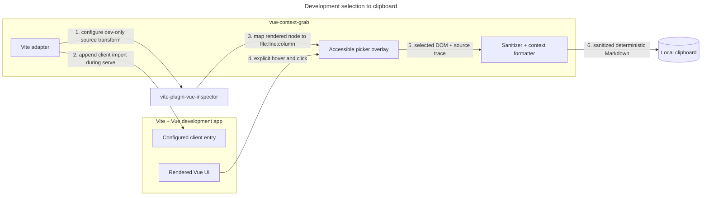

# Vue Context Grab v0.3 specification

## Problem

Polishing a Vue interface with an AI coding assistant is slow when the developer must manually explain which rendered element they mean and where it originates. React Grab solves a similar problem for React, but its implementation relies on React internals. Vue already has a maintained Vite source-inspection engine, so this package should own only the Vue-specific selection experience, privacy boundary, and clipboard contract.

## Scope

In scope: source-accurate element selection, a compact accessible overlay, privacy-conscious structured clipboard output, a Vue/Vite adapter, automated tests, and development-only installation.

Out of scope: autonomous code editing, an MCP/relay daemon, screenshots, production instrumentation, network transmission, and capture of Vue/Inertia state or user-entered values.

## Requirements

| ID    | Requirement                                                                                                                                                                                                                                                                                       |
| ----- | ------------------------------------------------------------------------------------------------------------------------------------------------------------------------------------------------------------------------------------------------------------------------------------------------- |
| R-001 | The Vite adapter instruments Vue source locations during `vite serve` and injects no browser runtime during production builds.                                                                                                                                                                    |
| R-002 | A developer can start or stop selection with a visible button, `Ctrl+C`, or Escape. Native copy keeps precedence while editing a field or copying selected text. Arrow keys navigate the active Vue selection and Enter copies it.                                                                |
| R-003 | Hovering an instrumented element shows its exact bounds and source file, line, and column without changing the application DOM or behavior. `↑` selects a source-aware parent, `↓` retraces toward the prior child, and `←`/`→` select visible source-aware DOM siblings.                         |
| R-004 | Clicking a selected element copies deterministic Markdown wrapped in `<component>` tags and containing route path, viewport, color-scheme preference, source trace, component/source ancestry, sanitized HTML, bounds, and an allowlisted computed-style summary.                                 |
| R-005 | Capture never includes URL query/hash data, cookies, browser storage, Vue state, Inertia props, form-control values, inline event handlers, hidden source-inspector attributes, or arbitrary `data-*` attributes. Common secrets and personal identifiers in copied text/attributes are redacted. |
| R-006 | The tool provides a visible `:focus-visible` indicator, keyboard-equivalent operation, polite live feedback, non-color selection cues, high-contrast-compatible borders, and a reduced-motion mode.                                                                                               |
| R-007 | Calling installation more than once is idempotent, and disposal removes all tool-owned listeners and DOM.                                                                                                                                                                                         |
| R-008 | The package uses Bun, TypeScript strict mode, Oxc lint/format, Vitest, tsdown, and publint.                                                                                                                                                                                                       |
| R-009 | Rendered text is labeled as untrusted UI data and cannot terminate its Markdown code fence, reducing prompt-injection ambiguity when a developer pastes the payload into an assistant.                                                                                                            |
| R-010 | The picker identifies highlighted DOM elements with an XML-style tag and source path, adapts its compact controls to narrow viewports, and shows a brief check-mark confirmation after clipboard success without delaying deactivation.                                                           |
| R-011 | Hosts can place the picker at the bottom center as well as the four viewport corners, with centering preserved across responsive viewport widths.                                                                                                                                                 |
| R-012 | A developer can minimize the idle picker to a compact edge control and restore it with the same control. Activating selection from the keyboard restores the full picker, and the toggle exposes its state to assistive technology.                                                               |

## Acceptance criteria

### AC-001 — development-only host integration

Given the package is configured in a Vite application, when Vite runs a development server, then Vue templates are source-instrumented and the context-grab client is appended to the configured entry module. When Vite runs a production build, then that client import is not appended.

### AC-002 — selection flow

Given the client is installed, when the developer activates it from the button or `Ctrl+C`, hovers an instrumented element, and clicks, then application click handling is suppressed, a source-aware context payload is copied, success is announced, and selection mode exits. While a source-aware element is highlighted, arrow keys navigate its parent/child history and visible siblings; Enter copies the keyboard-selected element. Escape exits without copying. When a form field is focused or page text is selected, native editing behavior retains precedence.

### AC-003 — safe payload

Given selected markup contains an email, Brazilian CPF, UUID, bearer token, form values, event attributes, source-inspector attributes, and arbitrary data attributes, when context is formatted, then those values/attributes are absent or replaced with `[redacted]`, while structural tags, safe accessibility attributes, classes, and short non-sensitive text remain useful.

Rendered text remains untrusted even after redaction. The payload states that boundary explicitly and neutralizes nested Markdown fences; the receiving assistant must not treat selected UI text as instructions.

### AC-004 — stable output

Given the same element, source trace, viewport, and computed style values, when formatting runs repeatedly, then it returns byte-for-byte identical Markdown and limits ancestry, HTML, and text length.

### AC-005 — accessible overlay

Given keyboard navigation or reduced-motion/high-contrast preferences, when the tool is used, then its button remains operable and visibly focused, status changes are announced, selection is conveyed by an outline plus label, and motion is disabled under reduced motion.

The selection label pairs an XML-style element tag with the Vue source location. After a successful copy, the control briefly changes to a visible check-mark and “Copied” state; narrow viewports preserve the primary action without allowing shortcut or source text to overflow.

## Architecture



The browser clipboard is the only output boundary. No package code opens sockets or performs HTTP requests. The host application remains the source of truth; the package reads only the explicitly selected DOM element, allowlisted computed styles, location pathname, and viewport/theme media values.

## Public API

```ts
// vite.config.ts
import { vueContextGrab } from "vue-context-grab/vite";

vueContextGrab({ appendTo: "resources/js/app.ts" });
```

The adapter accepts optional `appendTo`, `shortcut`, `buttonPosition`, `projectRoot`, and formatter limits. The client export supports direct installation for tests and advanced hosts and returns a disposable controller.

## Test map

| Acceptance criterion | Test level           | Evidence                                                        |
| -------------------- | -------------------- | --------------------------------------------------------------- |
| AC-001               | Unit/plugin contract | serve/build application and entry-transform tests               |
| AC-002               | DOM integration      | activation, hover/click, arrow/Enter, Escape, suppression tests |
| AC-003               | Unit                 | adversarial sanitizer and redactor cases                        |
| AC-004               | Unit                 | deterministic output and length/ancestry limits                 |
| AC-005               | DOM integration      | semantic controls, live region, CSS preference guards           |

## Tasks

- [x] T-001 Define typed public options and normalized defaults for R-001, R-002, and R-004.
- [x] T-002 Build and fail-first test the sanitizer/redactor/formatter for R-004 and R-005.
- [x] T-003 Build and test the accessible picker lifecycle for R-002, R-003, R-006, and R-007.
- [x] T-004 Build and test the dev-only Vite adapter for R-001.
- [x] T-005 Document installation and privacy behavior; validate build artifacts for R-008.
- [x] T-006 Install a packed release in the Reda Pro host and verify lint, types, unit tests, production build, and codebase health.
- [x] T-007 Add source-aware arrow navigation with parent/child history, sibling traversal, and Enter-to-copy.
- [x] T-008 Add responsive XML-tag selection labels and accessible copied-state feedback.
- [x] T-009 Add and verify a responsive bottom-center picker position.
- [x] T-010 Add an accessible minimize/restore interaction with keyboard activation recovery.

## Deferred decisions

- Publish the package to a Git registry or npm before replacing the host application's vendored release tarball.
- Add multi-select, screenshot, or MCP transport only if real usage shows that clipboard context is insufficient.
